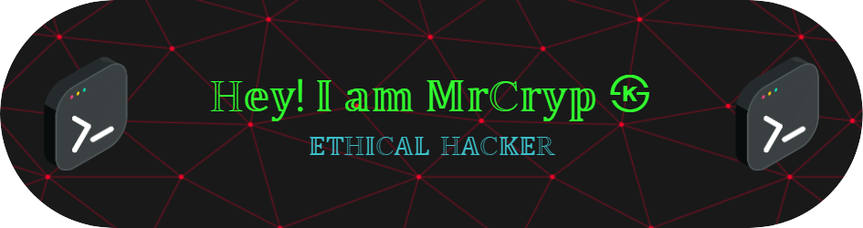

## 
 🕷️ 𝕎𝕖𝕝𝕔𝕠𝕞𝕖 𝕥𝕠 𝕥𝕙𝕖 𝕤𝕙𝕒𝕕𝕠𝕨𝕤! 🕷️
 

 
## 
 🧑🏻‍💻 𝕎𝕙𝕠𝕒𝕞𝕚 🕷️

  ᴠᴇʀꜱᴀᴛɪʟᴇ ᴀɴᴅ ʜɪɢʜʟʏ ꜱᴋɪʟʟᴇᴅ ᴄʏʙᴇʀꜱᴇᴄᴜʀɪᴛʏ ꜱᴘᴇᴄɪᴀʟɪꜱᴛ ᴡɪᴛʜ 5+ ʏᴇᴀʀꜱ ᴏꜰ ᴇxᴘᴇʀɪᴇɴᴄᴇ ɪɴ ꜱᴏꜰᴛᴡᴀʀᴇ ᴅᴇᴠᴇʟᴏᴘᴍᴇɴᴛ ᴀɴᴅ ᴏꜰꜰᴇɴꜱɪᴠᴇ ꜱᴇᴄᴜʀɪᴛʏ. 
  ᴅᴇᴇᴘʟʏ ᴋɴᴏᴡʟᴇᴅɢᴇᴀʙʟᴇ ɪɴ ᴛʜᴇ ꜰᴜʟʟ ꜱᴏꜰᴛᴡᴀʀᴇ ᴅᴇᴠᴇʟᴏᴘᴍᴇɴᴛ ʟɪꜰᴇᴄʏᴄʟᴇ ᴀɴᴅ ɪɴꜰʀᴀꜱᴛʀᴜᴄᴛᴜʀᴇ ᴍᴀɴᴀɢᴇᴍᴇɴᴛ, ᴡɪᴛʜ ʜᴀɴᴅꜱ-ᴏɴ ᴇxᴘᴇʀᴛɪꜱᴇ ɪɴ ʙᴜɪʟᴅɪɴɢ, ꜱᴇᴄᴜʀɪɴɢ, ᴀɴᴅ ꜱᴄᴀʟɪɴɢ ʀᴇꜱɪʟɪᴇɴᴛ ꜱʏꜱᴛᴇᴍꜱ. 
  ᴘᴀꜱꜱɪᴏɴᴀᴛᴇ ᴀʙᴏᴜᴛ ʀᴇᴅ ᴛᴇᴀᴍ ᴏᴘᴇʀᴀᴛɪᴏɴꜱ ᴀɴᴅ ᴠᴜʟɴᴇʀᴀʙɪʟɪᴛʏ ᴇxᴘʟᴏɪᴛᴀᴛɪᴏɴ ᴛᴏ ꜱᴛʀᴇɴɢᴛʜᴇɴ ᴅɪɢɪᴛᴀʟ ᴅᴇꜰᴇɴꜱᴇꜱ. 

ᴘʀɪᴠᴀᴄʏ | ꜱᴇᴄᴜʀɪᴛʏ | ꜰʀᴇᴇᴅᴏᴍ

  ʀᴇᴅ ᴛᴇᴀᴍ & ᴘᴇɴᴇᴛʀᴀᴛɪᴏɴ ᴛᴇꜱᴛɪɴɢ | ᴏꜱᴄᴘ, ᴄᴇʜ, ᴄɪꜱꜱᴘ & ᴄᴘᴇ ᴄᴇʀᴛɪꜰɪᴇᴅ | ᴇxᴘʟᴏɪᴛɪɴɢ & ꜱᴇᴄᴜʀɪɴɢ ᴛʜᴇ ᴅɪɢɪᴛᴀʟ ᴡᴏʀʟᴅ 💻🔐

---

### 
 🧨 𝕊𝕪𝕤𝕥𝕖𝕞𝕤 𝕀 𝔹𝕠𝕠𝕥 𝕥𝕠 𝔹𝕣𝕖𝕒𝕜 & 𝔹𝕦𝕚𝕝𝕕 🔥

  
  
  

---

### 
 🔐 ℂ𝕖𝕣𝕥𝕚𝕗𝕚𝕖𝕕 & ℙ𝕣𝕠𝕧𝕖𝕟 ℍ𝕒𝕔𝕜𝕖𝕣 𝕊𝕜𝕚𝕝𝕝𝕤

  
  
  
  

---

### 
 🔧 ℍ𝕒𝕔𝕜𝕚𝕟𝕘 & ℙ𝕖𝕟𝕥𝕖𝕤𝕥𝕚𝕟𝕘 𝔸𝕣𝕤𝕖𝕟𝕒𝕝

  
  
  
  
  
  

---

### 
 🪙 ℙ𝕣𝕚𝕧𝕒𝕔𝕪-𝔽𝕚𝕣𝕤𝕥 ℂ𝕣𝕪𝕡𝕥𝕠 𝕊𝕥𝕒𝕔𝕜

  
  
  
  

---

### 
 📬 𝕃𝕖𝕥'𝕤 ℂ𝕠𝕟𝕟𝕖𝕔𝕥

  

--- 
