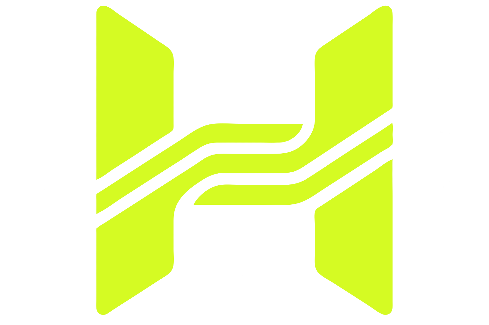

# MrCrypPrivacy

### Open-source Maintainer & Contributor

**Privacy · Security · Software**

 

**ɴᴏ ᴅᴀᴛᴀ. ɴᴏ ᴛʀᴜꜱᴛ. ᴋɴᴏᴡ ᴇᴠᴇʀʏ ᴠᴜʟɴ.**

 

---

## About

I build and maintain open-source software focused on **privacy, security, and user-controlled technology**.

I enjoy turning real-world problems into practical tools — with an emphasis on transparency, local processing, and minimizing unnecessary dependencies or third-party services.

---

## What I Work On

|         🔐 Security         |      🛡️ Privacy     |      🧑‍💻 Open Source     |           ⚙️ Software          |
| :-------------------------: | :------------------: | :------------------------: | :----------------------------: |
| Security research & tooling | Local-first software | Maintaining & contributing | Practical tools & applications |

---

## Projects

### [Auditra](https://github.com/MrCrypPrivacy/Auditra)

**A desktop trade analytics dashboard for Hyperliquid wallets.**

`Flutter` · `Dart` · `Desktop`

 

### Hushrate Miner

**A privacy-focused Monero mining project.**

`In Development`

 

### Privox

**A privacy-focused, local-first real-time voice translation project.**

`In Development`

 

### [QR Generator](https://github.com/MrCrypPrivacy/qr_generator)

**A simple local QR code generator built with privacy in mind.**

`Python` · `Local-first`

---

## Technologies

 

**Languages**

`Python` · `Dart` · `C#` · `GDScript` · `C/C++` · `Bash`

  

**Frameworks & Tools**

`Flutter` · `Godot` · `Linux` · `Git` · `GitHub` · `Docker`

  

**Areas**

`Cybersecurity` · `Privacy` · `Open Source` · `Blockchain`

---

## Open Source

I believe software should be **transparent, auditable, and accessible**.

I'm interested in building, maintaining, and contributing to projects that give users more control over their technology and their data.

---

## Connect

  

**Open to collaboration, contributions, and interesting projects.**

 

---

ɴᴏ ᴅᴀᴛᴀ. ɴᴏ ᴛʀᴜꜱᴛ. ᴋɴᴏᴡ ᴇᴠᴇʀʏ ᴠᴜʟɴ.

